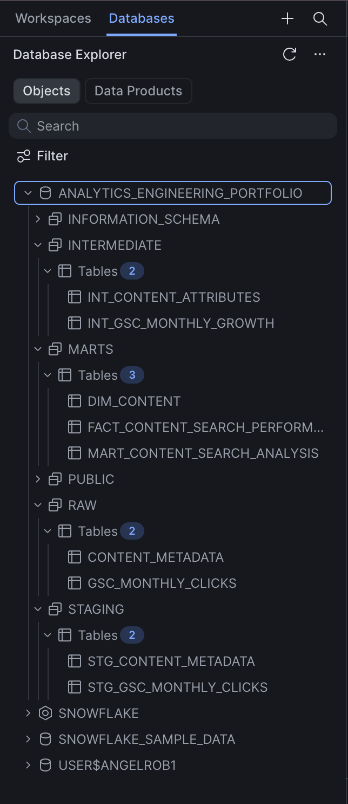
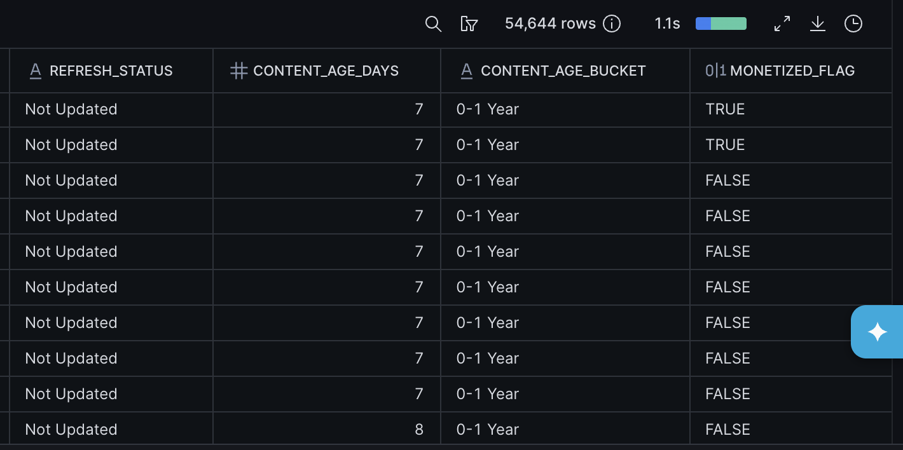
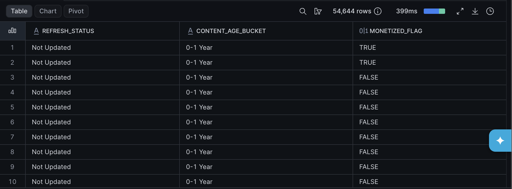
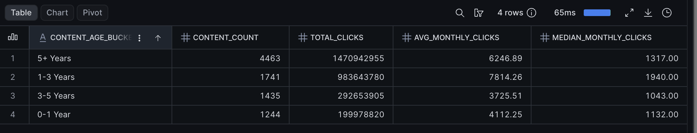

# Content Search Performance Data Model

## Analytics Engineering Project Using Snowflake & SQL

This project demonstrates an end-to-end analytics engineering workflow using publisher content metadata and Google Search Console (GSC) search performance data.

The goal was to transform raw CMS and search data into a dimensional model that supports scalable reporting and analysis of content performance in Google Search.

The project includes:

- Snowflake data warehouse
- Dimensional modeling (Star Schema)
- Fact and Dimension tables
- SQL transformations
- Window functions
- Data quality validation
- Business-focused performance analysis

---

# Project Goals

This project was built to:

- Practice analytics engineering workflows
- Design a dimensional data model
- Create analytics-ready datasets
- Demonstrate fact and dimension table design
- Build reusable SQL transformations
- Surface actionable business insights from search performance data

---

# Business Questions

The model was designed to answer questions such as:

- Do updated articles outperform content that has never been updated?
- How does content age impact search performance?
- Do monetized articles generate more search traffic?
- Which articles are experiencing the fastest growth in search traffic?
- How can search performance data be integrated with CMS metadata for analysis?

---

# Data Sources

## WordPress Content Metadata

Content-level metadata exported from WordPress.

Fields included:

- Post ID
- Canonical URL
- Post URL
- Category
- Author
- Team
- Tags
- Publish Date
- Update Date
- Product Catalog Count
- Product Embed Count

Rows: 54,644

---

## Google Search Console

Daily search performance data exported from Google Search Console.

Although some table names reference "monthly" clicks, the final dataset used in this project contains daily search performance records.

Fields included:

- URL
- Date
- Clicks

Rows: 490,371

---

# Data Model

The project follows a dimensional modeling approach.

## Dimension Table

### DIM_CONTENT

**Grain:** 1 row = 1 content item

Contains:

- Content metadata
- Category
- Author
- Team
- Publish date
- Update date
- Refresh status
- Content age bucket
- Monetization flags

---

## Fact Table

### FACT_CONTENT_SEARCH_PERFORMANCE

**Grain:** 1 row = 1 URL per day

Contains:

- Daily clicks
- Previous period clicks
- Growth percentage

---

## Analysis Mart

### MART_CONTENT_SEARCH_ANALYSIS

Business-ready table joining:

- DIM_CONTENT
- FACT_CONTENT_SEARCH_PERFORMANCE

Used for reporting and analysis.

---

# Project Architecture

```text
RAW
│
├── RAW_CONTENT_METADATA
├── RAW_GSC_MONTHLY_CLICKS

STAGING
│
├── STG_CONTENT_METADATA
├── STG_GSC_MONTHLY_CLICKS

INTERMEDIATE
│
├── INT_CONTENT_ATTRIBUTES
├── INT_GSC_MONTHLY_GROWTH

MARTS
│
├── DIM_CONTENT
├── FACT_CONTENT_SEARCH_PERFORMANCE
├── MART_CONTENT_SEARCH_ANALYSIS
```


# Key Transformations

## URL Standardization

Standardized URLs to support joins between WordPress and Google Search Console datasets.

## Content Attributes

Created business-focused attributes including:

- Refresh Status
- Content Age (Days)
- Content Age Bucket
- Monetized Flag



Example:

```sql
CASE
    WHEN UPDATE_DATE IS NOT NULL
    THEN 'Updated'
    ELSE 'Not Updated'
END
```

## Growth Calculations

Calculated search growth using window functions.

Example:

```sql
LAG(CLICKS)
OVER (
    PARTITION BY URL
    ORDER BY MONTH_DATE
)
```

Used to create:

- Previous Period Clicks
- Growth Percentage

---

# Data Quality & Validation

Validation checks were performed throughout the modeling process.

### Dimension Validation

- Total Content Records: 54,644
- Distinct Content Keys: 54,644
- Null Content Keys: 0

### Fact Validation

- Total Fact Records: 490,371
- Duplicate URL-Date Records: 0

### Join Validation

- Matched Records: 99.62%
- Unmatched Records: 0.38%

Investigation of unmatched records revealed a combination of:

- Search pages
- Collection pages
- Legacy URLs
- URLs no longer represented in the CMS export

---

# Analysis & Key Findings

## Updated Content Outperformed Non-Updated Content



| Metric | Updated | Not Updated |
|----------|----------:|----------:|
| Avg Clicks | 7,849 | 3,378 |
| Median Clicks | 1,752 | 1,008 |

**Finding:** Updated content generated more than 2x the average monthly search traffic compared to content that had never been updated.

## Content Aged 1–3 Years Performed Best



| Age Bucket | Avg Clicks |
|------------|----------:|
| 1–3 Years | 7,814 |
| 5+ Years | 6,247 |
| 0–1 Year | 4,112 |
| 3–5 Years | 3,726 |

**Finding:** Content between 1–3 years old produced the highest average search traffic, suggesting that content often requires time to mature in search before reaching peak performance.

## Monetized Content Generated Higher Search Traffic

| Metric | Monetized | Non-Monetized |
|----------|----------:|----------:|
| Avg Monthly Clicks | 7,590 | 5,861 |
| Median Monthly Clicks | 1,449 | 1,356 |

**Finding:** Monetized content generated approximately 30% higher average monthly search traffic than non-monetized content.

## Top Growing Content

Using growth calculations built with SQL window functions, the model identified content experiencing significant traffic acceleration.

This analysis demonstrates how window functions can be used to surface emerging search winners and content momentum trends.

---

# Technologies Used

- Snowflake
- SQL
- Dimensional Modeling
- Data Warehousing
- Window Functions
- Data Validation
- Analytics Engineering Concepts

---

# Repository Structure

```text
analytics-content-search-model/
│
├── sql/
│   ├── staging/
│   ├── intermediate/
│   └── marts/
│
├── screenshots/
│
└── README.md
```

---

# Future Improvements

Potential future enhancements include:

- Implementing the model in dbt
- Adding automated data quality tests
- Incorporating impressions, CTR, and average position from GSC
- Building a reporting dashboard
- Creating a date dimension table
- Adding content refresh recommendation logic

This project was built as part of my transition toward Analytics Engineering and demonstrates dimensional modeling, SQL transformation, and data warehouse design concepts commonly used in modern analytics teams.
